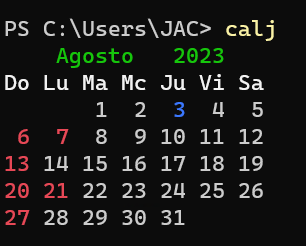
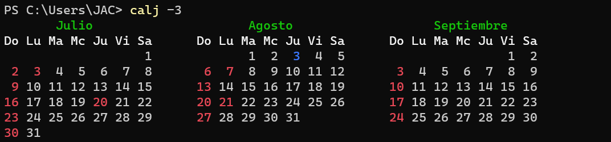
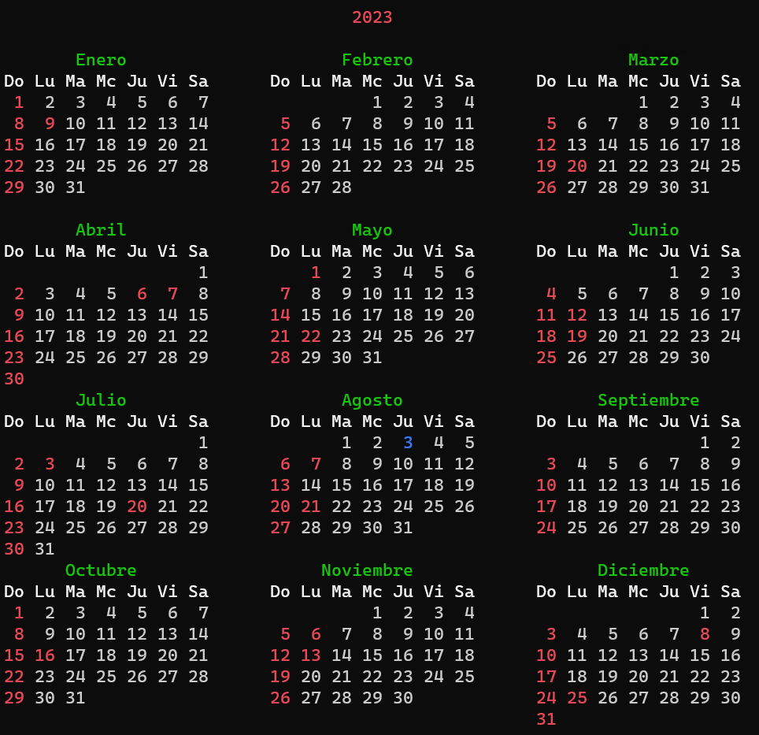

# Calj
**Calj** es una aplicación de consola en Python que genera calendarios anuales o mensuales con los festivos oficiales de Colombia, calculados automáticamente según la Ley 51 de 1983 (Ley Emiliani) y fechas religiosas basadas en la Pascua. No requiere conexión a internet ni base de datos externa.
Es una re-creación del comando UNIX cal; pero a color y con festivos.

## Características

- Calcula festivos colombianos desde 1984 en adelante.
- Colorea domingos y festivos en rojo, y el día actual en azul.
- Muestra calendarios mensuales, anuales o de 3 meses.
- Funciona completamente offline.
- Compatible con Windows y Linux.
- Puede compilarse como `.exe` con ícono personalizado.

Además, el código incluye comentarios que explican varias secciones del código y proporciona instrucciones sobre cómo compilar y ejecutar el script.

## USO desde consola

| Ejemplo | Descripción |Imagen  | 
|-------------------|-------------|-------------|
| calj | mes actual ||
| calj -3| calendario tres meses       || 
| calj 2023 | año escrito||

