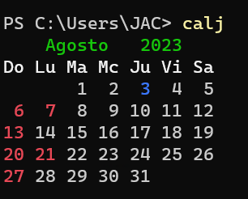
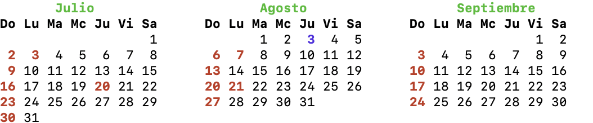
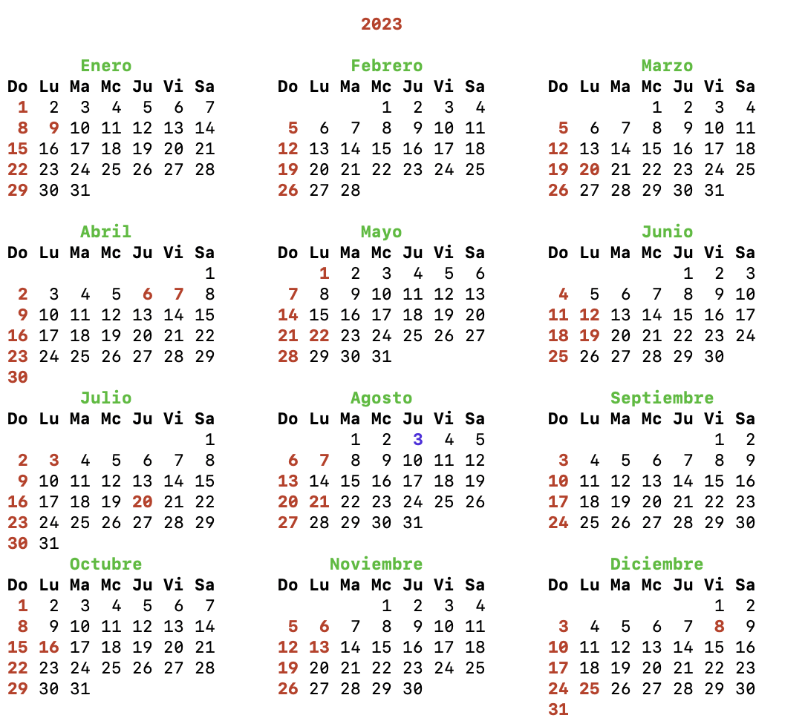

# Calj
Código de un calendario en consola a color y resalta los días festivos de Colombia
Es una re-creación del comando UNIX cal; pero a color y con festivos.

El código genera un calendario en la consola para el mes actual o un año específico, utilizando la biblioteca Colorama para obtener una salida en colores.

El programa comienza inicializando Colorama y cargando los días festivos desde la base de datos SQLite. Luego analiza los argumentos de línea de comandos para determinar si se debe mostrar el calendario para el mes actual, un año específico o un período de tres meses. El calendario se imprime en la consola, resaltando la fecha de hoy en azul y marcando los días festivos en rojo.

Además, el código incluye comentarios que explican varias secciones del código y proporciona instrucciones sobre cómo compilar y ejecutar el script.

## USO desde consola

| Uso | Descripción |Imagen  | 
|-------------------|-------------|-------------|
| calj | mes actual ||
| calj -3| calendario tres meses       || 
| calj 2023 | año escrito||

